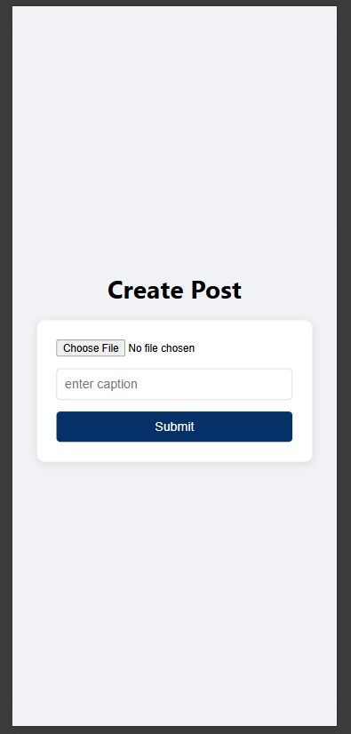
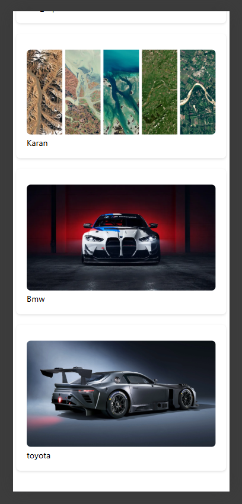

# Social Posting App

A full-stack social media application built with the MERN stack where users can create posts, upload images, view feeds, and interact with content.

## 🚀 Features

* User Authentication
* Create, Read, Update, and Delete Posts
* Image Upload Support
* Responsive User Interface
* Real-Time Feed Updates
* MongoDB Database Integration
* RESTful API Architecture

## 🛠️ Tech Stack
## Screenshots

### Create Posts



### Feed Post



### Frontend

* React.js
* Axios
* CSS3

### Backend

* Node.js
* Express.js
* MongoDB
* Mongoose

### Other Tools

* Git & GitHub
* Postman
* Cloud Image Storage (if used)

## 📂 Project Structure

```bash
project-root/
├── Frontend/
│   ├── src/
│   ├── public/
│   └── package.json
│
├── Backend/
│   ├── controllers/
│   ├── models/
│   ├── routes/
│   ├── middleware/
│   ├── config/
│   └── server.js
│
└── README.md
```

## ⚙️ Installation

### Clone the Repository

```bash
git clone <repository-url>
cd project-folder
```

### Install Backend Dependencies

```bash
cd Backend
npm install
```

### Install Frontend Dependencies

```bash
cd ../Frontend
npm install
```

## 🔑 Environment Variables

Create a `.env` file inside the Backend folder and add:

```env
PORT=3000
MONGO_URI=your_mongodb_connection_string
JWT_SECRET=your_secret_key
```

## ▶️ Running the Application

### Start Backend

```bash
cd Backend
npm run dev
```

### Start Frontend

```bash
cd Frontend
npm run dev
```

The application should now be running locally.

## API Endpoints

### Authentication

* POST /register
* POST /login

### Posts

* GET /posts
* POST /posts
* PATCH /posts/:id
* DELETE /posts/:id

## Future Improvements

* Likes and Comments
* User Profiles
* Follow/Unfollow System
* Real-Time Notifications
* Dark Mode
* Search Functionality


## Author

Rana

Final Year B.Tech Student | MERN Stack Developer

## License

This project is open-source and available under the MIT License.
